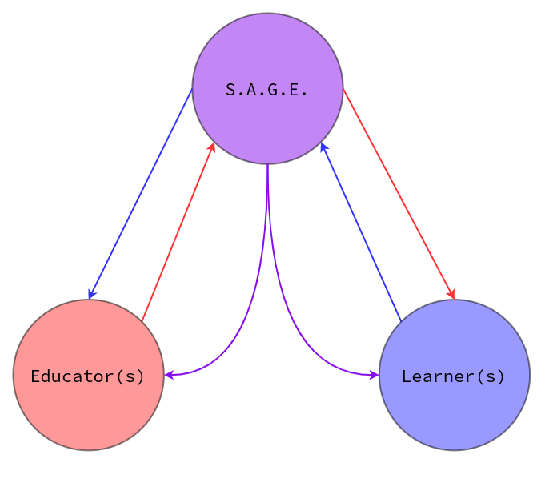

# What's a S.A.G.E?

### [System of Autonomous Global Education](../sage/soge-design/sage-summary.md#system-of-global-education)

 A system of autonomous global education or a **S.A.G.E.** is a universally accessible open-source system for the advancement of learning. This system aims to change the way information is delivered and how the school system fundamentally functions— by treating each contributor in the SAGE network as equally capable. 

 Connecting Students/Individuals to Educators/Mentors with an autonomous, distributed and immutable overseer or **SAGE**. An [Open-Musaeum](https://www.wikiwand.com/en/Musaeum), fostering and pushing forward the growth and establishment of higher-thinking and critical engagement of information. 

 Giving the same opportunities to a student and a teacher by giving control to the individual. Allowing the ability to teach or learn what you want, where you want and when you want. Providing applications and directed knowledge to strengthen humanity and build prestigious institutions & individuals backed by honesty and reliability by incentivizing trustworthiness and consistent effort.



```text
if; Teachers can be student
then; Students can be teachers
<----------------------------------------->
if; Good teachers can create good students
then; Bad teachers can create bad students
```



