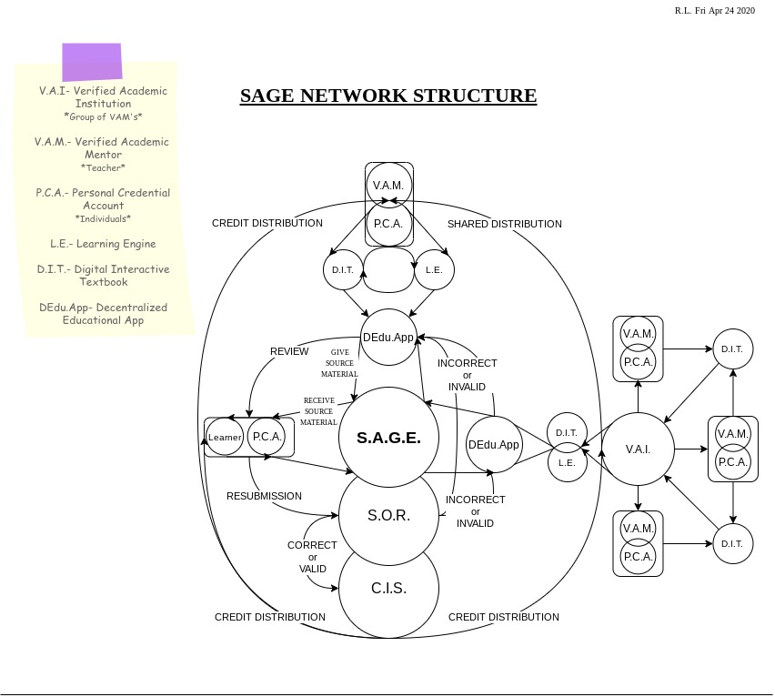

# Components 📋

## Overview of the S.A.G.E.

 A look at the network structure, components and ideas around the system of autonomous global education. 

### Component Overview



### [Decentralized Educational Application](edu.dapp/)💻📔

#### Components

* [System of Recognition\(SOR\) ](edu.dapp/sor/)
* [Credit Issuance System\(CIS\) ](edu.dapp/cis/)
* [Personal Credential Account\(PCA\)](edu.dapp/pca/)

#### Conditions

* Open-source
* Decentralized
* Peer-to-Peer Network
* Clustered File System



### [Verified Academic Institutions](vai.md)🏫🏘️ ☑️

#### Contributors

* Private or Public Universities
* Private or Public Schools
* Group Workshops
* Mentor Groups
* Private or Public Academies

#### Conditions

* Democratic
* Distributed Databases
* Clustered File Systems
* Verified



### [Verified Academic Mentors](vam.md)👩‍🏫👨‍🏫☑️

#### Contributors

* Credential Holders
* Individual Professors or Teachers 
* Private or Public Tutors

#### Conditions

* Personal Credential Account
* Verified



### [Digital Interactive Textbook\(s\) & Learning Engines](dit.md)💻📚

#### Components

* Simulations/Interactive Learning Engines
* Virtual/Augmented Learning Environments

#### Conditions

* Open or Closed Source
* Digital, Downloadable or Streamable
* Publicly or Privately Accessible
* Distributable
* Compatible
* Frequently Updated/Maintained



### Network Structure Overview

#### Visual Example of S.A.G.E.



## Open-Project\(s\)

### System of Autonomous Global Education

S.A.G.E.

### Digital Interactive Textbooks

[Idiot&lt;Knowledge](https://idiotknowledge.com)

### Learning Engines

```text
@knowledgeableidiot:~/
discussions="in progress"

Currently discussing structures and implementations of Learning Engines!
:~/
Stay Tuned(:
```

