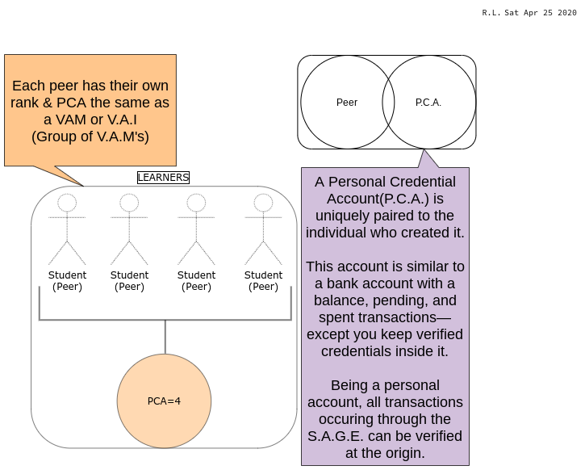
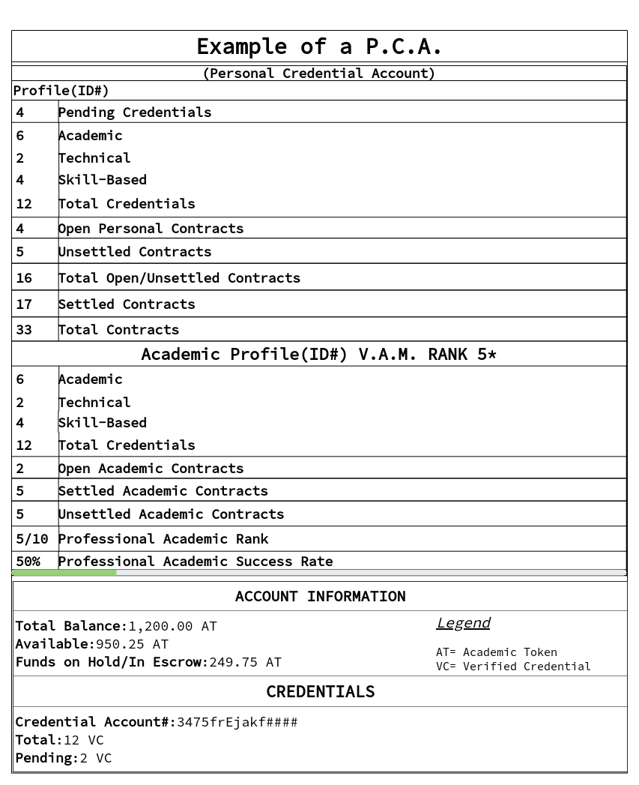

# P.C.A. 📥🏅🏆

## Personal Credential Account


**Definition:** P.C.A.

* Personal Account for individuals, academic professionals/amateurs to keep track of their credentials and skills earned through the completion or settlement of educational-based smart contracts.


### Visual Overview

### Basic P.C.A. Example

#### Personal Credential Account Basics

* Profiles -Academic: Mentor, Institute, Individual -Personal: Individual 
* Unique Identifiers
* Rate of settlement \(Open v.s. Closed\)
* Categorized Credentials

#### Account Information

* Balance -Pending: Academic Tokens\(FT **only useable with S.A.G.E.**\) -Available: Academic Tokens\(FT\) -Funds on Hold/In Escrow: Academic Tokens\(FT\) 
* Holds Verified Credential\(s\)\(NFT's\) -Total: VC -Pending: VC

